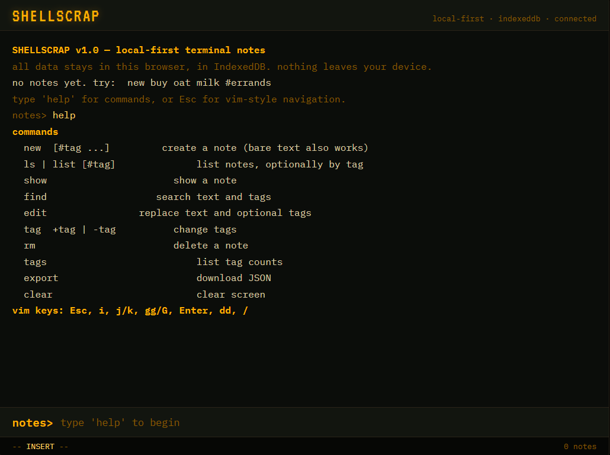

<div align="center">


<br>

<a href="https://shellscrap.netlify.app/">

</a>

<a href="https://github.com/MUdevelops/ShellScrap">

</a>

<br><br>


<br>

### 🖥️ Local-First • Terminal-Style • Zero Backend

</div>

---

## ⚡ About

**ShellScrap** is a lightweight browser-based notes manager with a retro terminal interface.

Create, organize, search, tag, edit, delete and export your notes — directly from the terminal.

```text
> new Build my AI project #AI #Development
> ls
> find AI
> tags
> export
```

---

## ✨ Features

|     | Feature               |                              |
| --- | --------------------- | ---------------------------- |
| 📝  | **Create & Edit**     | Manage notes quickly         |
| 🔎  | **Search**            | Find notes instantly         |
| 🏷️ | **Tags**              | Organize with `#tags`        |
| 💾  | **IndexedDB**         | Persistent browser storage   |
| 📦  | **JSON Export**       | Backup your notes            |
| ⌨️  | **Keyboard Controls** | Vim-inspired workflow        |
| 🖥️ | **Terminal UI**       | Retro CRT experience         |
| ⚡   | **No Backend**        | Runs directly in the browser |

---

## ⌨️ Commands

```text
new <text>          Create a note
ls                  Display all notes
ls #tag             Filter by tag
show <id>           Display a note
find <query>        Search notes
edit <id> <text>    Edit a note
tag <id> +tag       Add a tag
tag <id> -tag       Remove a tag
rm <id>             Delete a note
tags                Show all tags
export              Export notes as JSON
clear               Clear terminal
help                Show commands
```

---

## 🎮 Keyboard Navigation

```text
i       → INSERT mode
Esc     → NORMAL mode
j / k   → Move down / up
gg      → Jump to top
G       → Jump to bottom
Enter   → Open selected note
dd      → Delete selected note
/       → Search
```

---

## 💾 Local-First Architecture

```text
              ┌───────────────┐
              │  ShellScrap   │
              │  Terminal UI  │
              └───────┬───────┘
                      ↓
              ┌───────────────┐
              │  JavaScript   │
              └───────┬───────┘
                      ↓
              ┌───────────────┐
              │   IndexedDB   │
              └───────┬───────┘
                      ↓
               Browser Storage
```

No server-side database is required.

---

# 📸 Screenshots

<div align="center">

### 🖥️ Main Interface


<br><br>

### 📋 Display Notes

<table>
<tr>
<td width="50%" align="center">


**Display All Notes**

</td>

<td width="50%" align="center">


**Display One by One**

</td>
</tr>
</table>

### 💾 Saved Notes

<table>
<tr>
<td width="50%" align="center">


**Saved Notes**

</td>

<td width="50%" align="center">


**Clear Command**

</td>
</tr>
</table>

### 🔎 Search & Tags

<table>
<tr>
<td width="50%" align="center">


**Find Command**

</td>

<td width="50%" align="center">


**Tags Command**

</td>
</tr>

<tr>
<td width="50%" align="center">


**Tag / Untag**

</td>

<td width="50%" align="center">



**Help Command**

</td>
</tr>
</table>

### 📦 Export & Data

<table>
<tr>
<td width="50%" align="center">


**Export Command**

</td>

<td width="50%" align="center">


**JSON Export**

</td>
</tr>
</table>

### 🗑️ Delete

<div align="center">


**Delete All Notes**

</div>

</div>

---

## 🛠️ Tech Stack

```text
HTML5
CSS3
JavaScript
IndexedDB
JSON
```

Built without a frontend framework or backend server.

---

## 🚀 Live Preview

<div align="center">

### Try ShellScrap directly in your browser

<a href="https://shellscrap.netlify.app/">


</a>

<br><br>

**No installation required. Just open and start writing.**

</div>

---

## 📂 Project Structure

```text
ShellScrap/
│
├── Screenshots/
│   ├── Delete all notes.png
│   ├── Display all notes.png
│   ├── Display one by one.png
│   ├── Export Command.png
│   ├── Saved 3 Notes.png
│   ├── Use find command.png
│   ├── after clear command.png
│   ├── help.png
│   ├── json file.png
│   ├── main interface.png
│   ├── tag and untag.png
│   └── tags command.png
│
├── index.html
├── LICENSE
└── README.md
```

> `desktop.ini` is a Windows system file and does not need to be displayed as a project screenshot.

---

## 👨‍💻 Developer

<div align="center">

### Muhammad Umar Jamal

**MUdevelops**

Software Developer • AI Enthusiast • Full-Stack Developer

<br>

<a href="https://github.com/MUdevelops">

</a>

<a href="https://m-umar-jamal.netlify.app/">

</a>

</div>

---

<div align="center">

### ⭐ ShellScrap

**Capture it. Tag it. Search it. Ship it.**

```text
> help
> create something awesome
```

<br>


</div>
